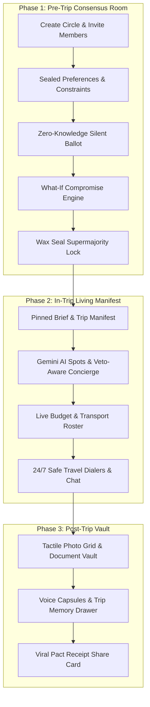

# PACT — Plan A Consensus Trip

> **End group travel paralysis. Instantly.**

[](https://expo.dev)
[](https://www.typescriptlang.org/)
[](https://supabase.com)
[](https://revenuecat.com)
[](https://docs.swmansion.com/react-native-reanimated/)
[](package.json)

---

## ⚡ 5-Minute Judge Sandbox Guide

Test the full end-to-end consensus lifecycle in under 5 minutes with zero setup or login required:

1. **Launch App**: Run `npm run web` (or open live build) and tap `[ ⚡ Try 5-Min Judge Sandbox ]` on the landing screen.
2. **Pre-Trip Consensus Room**:
   - Inspect the **Zero-Knowledge Silent Ballot**: cast sealed dates, budget caps, and dealbreakers for Goa 2026.
   - Test the **What-If Compromise Simulator**: adjust budget ceilings in real-time to watch Pareto-optimal scores shift instantly.
   - Experience the **Wax Seal Voting**: seal your secret ballot ticket with haptic feedback and physics animations.
3. **In-Trip Living Manifest**:
   - View the locked destination, dates, and live budget tracking on the Circle Hub.
   - Explore Gemini AI Place & Activity recommendations, Veto-Aware Concierge anchors, and verified safe transport contacts.
4. **Post-Trip Vault**:
   - Open the Past Trips Vault (`app/vault.tsx`) to explore the tactile memories grid, Pact Receipts, and play back Voice Capsules.

---

## 📐 The Core Problem: Group Coordination Failure

Group travel planning suffers from a classic **Pareto Inefficiency & Social Dilemma**:

```
                              [ Group Chat Chaos ]
                                        │
           ┌────────────────────────────┴────────────────────────────┐
           ▼                                                         ▼
[ Loudest Voice Dominance ]                               [ Unspoken Budget Shaming ]
  • One member books unilaterally                           • Members fear speaking up
  • Resentment & budget strain                              • Flaky commitments & delay
           │                                                         │
           └────────────────────────────┬────────────────────────────┘
                                        ▼
                             [ Total Travel Paralysis ]
```

When 4 to 24 friends attempt to coordinate dates, budgets, vibes, and dealbreakers over WhatsApp or iMessage, three mathematical friction points destroy consensus:
1. **Asymmetric Preferences**: Social friction prevents members from revealing true budget ceilings or non-negotiable dealbreakers.
2. **Ghost Member Poisoning**: Unresponsive members skew traditional mean averages, blocking decision-making.
3. **Compromise Blindness**: Groups fail to discover Pareto-optimal intersections where all members are satisfied.

**PACT solves this using Zero-Knowledge Silent Ballots + Deterministic Consensus Mathematics.**

---

## 🏗️ The 3-Phase Architecture

PACT governs the entire trip lifecycle across three distinct phases:



### Technical System Layers:
```
┌────────────────────────────────────────────────────────────────────────┐
│                        Expo SDK 52 + React Native                      │
├────────────────────────────────────────────────────────────────────────┤
│                 Zustand Reactive Multi-Store Engine                    │
│   (useGatherlyStore • useCircleStore • useVoteStore • useNotificationStore)│
├──────────────────────────────────┬─────────────────────────────────────┤
│     Deterministic Consensus      │     Veto-Aware Gemini Edge AI       │
│      Engine (TypeScript/JS)      │   (Supabase Edge / Local Fallbacks)  │
├──────────────────────────────────┴─────────────────────────────────────┤
│                  Supabase PostgreSQL + RLS Security                    │
├────────────────────────────────────────────────────────────────────────┤
│             RevenueCat SDK & Pro Circle Inheritance Engine             │
└────────────────────────────────────────────────────────────────────────┘
```

---

## 💳 Monetization Architecture: RevenueCat Pro Circle Inheritance Spotlight

PACT implements a highly viral, friction-free monetization model designed for group dynamics:

```
┌────────────────────────────────────────────────────────────────────────┐
│                        Organizer Upgrades to Pro                       │
│                         (RevenueCat Subscription)                       │
└──────────────────────────────────┬─────────────────────────────────────┘
                                   │
                                   ▼
┌────────────────────────────────────────────────────────────────────────┐
│                        PRO CIRCLE INHERITANCE                          │
│        All 24 Invited Circle Members Automatically Inherit Pro         │
│          Zero Paywalls for Guests • 100% Frictionless Joining          │
└──────────────────────────────────┬─────────────────────────────────────┘
                                   │
                                   ▼
┌────────────────────────────────────────────────────────────────────────┐
│                        VIRAL MULTIPLAYER LOOP                          │
│   Guests experience Pro AI features ──> Guests create their own trips   │
│                 ──> Guests convert to Paying Organizers                │
└────────────────────────────────────────────────────────────────────────┘
```

### RevenueCat Features Employed:
- **Entitlement Management**: Checks `pro` entitlement state instantly via native RevenueCat SDK.
- **Pro Circle Inheritance**: RLS & store policies verify if the Circle Organizer possesses active Pro status. If true, all 24 invited members unlock premium AI Compromise Whispering, Voice Capsules, and unlimited trip history.
- **Cross-Platform Purchase Resilience**: Mobile native purchases sync seamlessly with web fallbacks.

---

## 🧮 Consensus Mathematics Formula

$$\text{Member Preference Score} = (\text{Date Match} \times 0.35) + (\text{Budget Fit} \times 0.35) + (\text{Vibe Similarity} \times 0.25)$$

1. **Dealbreaker Hard Disqualification**:
   $$\text{If } \text{Dealbreaker} \cap \text{Trip Attributes} \neq \emptyset \implies \text{Score} = 0.0$$
2. **Date Overlap (35%)**:
   $$\text{Date Match} = \frac{\text{Overlap Days}}{\text{Trip Duration}}$$
3. **Budget Fit (35%)**:
   $$\text{Budget Fit} = \begin{cases} 1.0 & \text{if } C_{\text{trip}} \le B_{\text{max}} \\ 0.0 & \text{if } C_{\text{trip}} > B_{\text{max}} \text{ (Disqualified)} \end{cases}$$
4. **Vibe Similarity (25%)**: Jaccard similarity coefficient across preferred activity tags.
5. **Supermajority Rule**: Requires $\ge 70\%$ agreement to seal the trip pact.

---

## 🛠️ Quickstart Guide

### Prerequisites
- **Node.js**: v18 or higher
- **npm**: v9 or higher

### 1. Clone & Install
```bash
git clone https://github.com/Jayadeep-Koundinya-R/PACT-Plan-A-Consensus-Trip.git
cd PACT-Plan-A-Consensus-Trip
npm install
```

### 2. Verify System & Run Tests
```bash
./node_modules/.bin/tsc --noEmit
npm test
```
*Expected: 0 TypeScript errors and 247/247 passing unit and integration tests.*

### 3. Launch Development Server
- **Web Development**:
  ```bash
  npm run web
  ```
- **Mobile Development (Expo Go / Emulator)**:
  ```bash
  npm start
  ```

---

## 📜 License

Distributed under the MIT License. See `LICENSE` for details.
