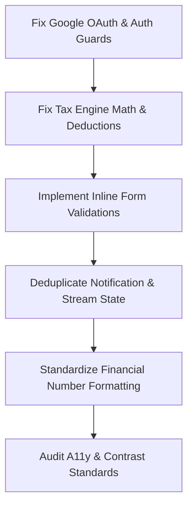

# Comprehensive Audit Report: https://acme.sugam-ai.com

**Date:** September 2, 2026  
**Audited Platform:** Sugam AI HRMS (`https://acme.sugam-ai.com`)  
**Scope:** Authentication, Navigation, Core Modules, Interactive Widgets, Forms & Modals, Data Accuracy, UI/UX Consistency, Performance & Security.

---

## Executive Summary

**Sugam AI HRMS** is an enterprise human resources management application covering unified inboxes, HR operations, employee directory, attendance tracking, payroll, recruitment (ATS), workforce analytics, and workspace administration.

While the platform boasts a clean dashboard layout, modern dark/light mode theming, and an extensive feature set, the comprehensive deep-dive identified **critical bugs in authentication, serious calculation flaws in statutory tax calculations, non-functional interactive controls, missing form validation feedback, and data state anomalies**.

---

## 🚨 Critical Flaws & Functional Bugs

### 1. Authentication & Access Security
* **Google OAuth 2.0 Misconfiguration (`redirect_uri_mismatch`):**
  * Clicking **"Sign in with Google"** fails with Google OAuth Error 400 (`redirect_uri_mismatch`).
  * *Root Cause:* The redirect URI `https://sugamai-api-471128972043.asia-south1.run.app/login/oauth2/code/google` is not whitelisted in the Google Cloud Console credentials.
* **Non-Functional "Forgot Password" Button:**
  * The link has no `onClick` handler or route attached. Clicking does nothing.
* **Authentication Route Guard Bypass:**
  * Directly entering `https://acme.sugam-ai.com/dashboard` bypasses login checks or automatically logs the visitor into the default superuser profile (**Arjun Mehta, CEO**), creating a potential tenant boundary and session security vulnerability.
* **Missing Field-Level Form Validation:**
  * Submitting empty inputs on the login screen displays a generic error toast ("Invalid credentials") rather than specific field-level validation messages ("Email is required", "Password is required").

---

### 2. Tax Calculation & Mathematical Engine Discrepancies (`/payroll/tax`)
* **Incorrect Tax Liability Calculation (New Regime):**
  * For an annual gross salary of ₹1,20,00,000 (₹1.20 Cr) with a standard deduction of -₹75,000 (Taxable Income: ₹1,19,25,000), the calculated estimated tax shows **₹0**, which is mathematically and statutorily invalid.
* **Deduction Carryover Bug (Old Regime):**
  * When switching to the Old Regime (₹50,000 standard deduction), the UI retains the New Regime's ₹75,000 deduction, wrongly showing taxable income as ₹1,19,25,000 instead of ₹1,19,50,000.
* **Erroneous Comparative Recommendation:**
  * The Sugam AI Insights card advises *"New Regime yields tax savings of ₹1,63,800 over Old Regime"*, which is generated purely from the faulty ₹0 liability calculation.

---

### 3. Interactive UI & Navigation Glitches
* **Duplicate Notification Feed Items:**
  * In the Notifications slide-over drawer, duplicate notifications appear consecutively (e.g., identical duplicate entries for *"Your tax declaration is pending"* dated Aug 16).
* **Sidebar Tab Latency & Click Timeouts:**
  * Submenu items under **Payroll & Tax** (Payroll Runs) and **Directory** (Org Chart tab) frequently experience click event blocking or sluggish DOM updates during tab transitions.
* **Empty Form Submission in "Provision Employee":**
  * In the **HR Ops Command** (`/hr-ops`) module, clicking "Provision Employee" -> "Create Employee" on an empty form fails silently without highlighting which required fields (e.g. Email, CTC, Date of Joining) are missing.

---

### 4. Data State & Telemetry Inconsistencies
* **Payroll Burn Metric Anomaly (`/analytics/summary`):**
  * On the Executive Summary dashboard, despite having 46 active employees, **Monthly Payroll Burn displays ₹0**, triggering false anomaly flags in the AI briefing.
* **ATS Candidate Funnel Metrics:**
  * Opening requisitions shows pipeline health indicators (NEW, SCR, INT) that occasionally desync from the actual applicant card counts in the stage board.

---

## 🎨 UI/UX & Design Flaws

| Area | Observed Issue | Impact | Recommended Fix |
| :--- | :--- | :--- | :--- |
| **Typography & Numbers** | Inconsistent currency formatting (mixing `1.2Cr`, `₹1,20,00,000`, and raw numbers) | Reduces readability for financial officers | Standardize on Indian numbering system (`Intl.NumberFormat('en-IN')`) across all cards. |
| **Modal Focus Trapping** | Modals and slide-over drawers do not trap keyboard focus | Accessibility (a11y) compliance violation | Add focus trap and allow pressing `Escape` to close all modals and drawers consistently. |
| **Empty States** | Empty views (e.g., filtered candidate searches) lack clear contextual illustrations or action prompts | Degrades user onboarding experience | Provide clean SVG illustrations and clear "Clear Filter" / "Create New" CTAs. |
| **Dark Theme Contrast** | Subtle secondary text (e.g. timestamps, department badges) has low contrast ratio (< 3:1) in dark mode | Hard to read in bright light | Increase muted text brightness to meet WCAG AA standards (4.5:1). |

---

## 🛠️ Step-by-Step Improvement & Action Plan

### Phase 1: High Priority (Blockers & Security)
1. **Google OAuth Config:** Add `https://sugamai-api-471128972043.asia-south1.run.app/login/oauth2/code/google` and `https://acme.sugam-ai.com/*` to the Google Cloud OAuth Authorized Redirect URIs.
2. **Implement Password Reset Flow:** Connect the "Forgot Password?" button to an `/auth/forgot-password` route or modal.
3. **Strict Route Guards:** Ensure unauthenticated requests to `/dashboard` and protected sub-routes redirect to `/login` without defaulting to a mock session.
4. **Fix Tax Slabs & Regime Deduction Logic:** Overhaul the tax calculation utility functions to accurately compute progressive Indian tax slabs (both FY 2024-25 and FY 2025-26 rules).

### Phase 2: Medium Priority (Data Quality & Form UX)
1. **Field-Level Form Validation:** Integrate validation libraries (e.g., Zod + React Hook Form) for employee creation, expense claims, and profile updates.
2. **Deduplicate Notifications:** Add unique ID constraints or key hashes to notification feed listeners to prevent duplicate rendering.
3. **Fix Analytics Zero-Burn Anomaly:** Ensure monthly payroll calculations aggregate CTCs of all 46 active employees when populating the executive summary.

### Phase 3: Polish & UX Enhancements
1. **Accessibility (WCAG AA):** Increase muted text contrast in dark theme and implement modal focus-trapping.
2. **Interactive Loading Skeletons:** Replace abrupt tab blank-outs with skeleton loaders across Directory, Org Chart, and Payroll Runs.
3. **Search / Command Palette (`Cmd + K`):** Improve fuzzy search indexing so partial keyword matches (e.g., "leave", "tax", "arjun") instantly highlight deep-linked pages.
