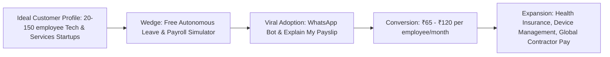

# Sugam AI Commercial Product & Company Blueprint
**Target:** Building a Flagship B2B HRMS & Workforce Operating System  
**Prepared For:** Founder & Lead Product Architect  
**Date:** September 2026  

---

## 1. Executive Summary & Market Reality Check

Building a B2B SaaS company starting with an HRMS (Human Resource Management System) is one of the **highest-leverage, highest-retention software businesses** in the world—if executed right. HRMS is the **system of record** for every organization. Once a company runs payroll and attendance on your platform, their **Net Revenue Retention (NRR) often exceeds 110%**, and churn is exceptionally low (< 5% annually) because switching HR software is operationally painful.

However, the market is crowded with legacy dinosaurs (SAP SuccessFactors, Workday), mid-market incumbents (Keka, Darwinbox, Zoho People), and modern global players (Rippling, Deel, BambooHR).

To stand out, command premium pricing, and build an unshakable company reputation, **you cannot just build "another HRMS."** You must build the platform that solves the exact, painful things that users and HR managers violently complain about in existing tools.

---

## 2. Real Competitor Analysis: What Users Hate & Complain About

Based on candid customer reviews, G2/Capterra feedback, and discussions across tech communities (Reddit r/humanresources, r/startups, Twitter/X), here are the exact grievances with existing tools:

### A. Keka (Leading SMB/Mid-market Player in India)
* **The Complaints:**
  1. *"Support is non-existent during payroll cutoffs."* When payroll errors happen on the 28th, support tickets take 48-72 hours, causing delayed salaries.
  2. *"Clunky attendance & biometric sync."* Mobile punches frequently fail or report false geofencing errors, leading to erroneous Loss of Pay (LOP).
  3. *"Overly rigid salary structures."* Hard to customize compensation components or state-specific professional tax rules without contacting their professional services.

### B. Darwinbox (Enterprise Enterprise Indian/Asian Giant)
* **The Complaints:**
  1. *"Feels like a clunky 2005 enterprise ERP."* Too many nested clicks, modal traps, and slow page transitions.
  2. *"Employee resentment over invasive mobile permissions."* Requires background location, camera, and device telemetry for attendance, which employees dislike.
  3. *"Over-engineered onboarding & setup."* Takes 3–6 months and hundreds of consultant hours just to go live.

### C. BambooHR (US SMB Standard)
* **The Complaints:**
  1. *"Hits a hard ceiling at 150+ employees."* Reporting tools become sluggish and inflexible.
  2. *"Weak native payroll & international support."* Relies heavily on third-party integrations (like Trax or Gusto) that often desync.

### D. Rippling (The Gold Standard in Modern HR & IT)
* **The Complaints:**
  1. *"Extremely expensive & aggressive upselling."* Forces companies into expensive multi-module contracts.
  2. *"Lack of localized compliance depth outside the US."* While expanding globally, deep statutory nuances (e.g. Indian PF/ESI/TDS or European labor laws) still require manual workarounds.

---

## 3. The 6 "Killer Differentiators" (How Your Product Wins)

To make your product instantly attractive and generate viral word-of-mouth among founders, CFOs, and HR heads, build these 6 capabilities into your core product:

```
                                 ┌──────────────────────────────────────────────┐
                                 │       SUGAM AI: THE AUTONOMOUS HRMS          │
                                 └──────────────────────┬───────────────────────┘
                                                        │
         ┌──────────────────┬───────────────────────────┼───────────────────────────┬──────────────────┐
         ▼                  ▼                           ▼                           ▼                  ▼
┌──────────────────┐┌───────────────────┐     ┌───────────────────┐       ┌───────────────────┐┌──────────────────┐
│ Explain My       ││ WhatsApp/Slack    │     │ 60-Second Instant │       │ Auto-Audit Proof  ││ Real-Time Tax    │
│ Payslip (AI)     ││ Zero-Dashboard    │     │ Onboarding        │       │ Statutory Engine  ││ Regime Simulator │
│ Zero HR tickets  ││ Conversational HR │     │ from Excel/Tally  │       │ 1-click filing    ││ Saves employee $$│
└──────────────────┘└───────────────────┘     └───────────────────┘       └───────────────────┘└──────────────────┘
```

### 1. "Explain My Payslip" — Eliminates 80% of HR Support Tickets
* **The Problem:** Every month on payday, employees flood HR with: *"Why was ₹3,200 deducted this month?"* or *"Why did my TDS increase?"*
* **Your Solution:** A prominent **"Explain My Deductions"** button on every digital payslip. Powered by your AI engine, it generates a simple 3-line human breakdown:
  > *"Compared to July, your August take-home is ₹2,800 lower because: (1) You had 1 day unapproved leave on Aug 12 (-₹1,800), and (2) Your TDS adjusted slightly based on your declared investments (-₹1,000). Click here to view details."*
* **Reputation Impact:** HR teams will advocate for you because it rescues them from monthly payday chaos.

### 2. "Zero-Dashboard" Conversational HR (WhatsApp & Slack Native)
* **The Problem:** Employees hate logging into an HR portal just to apply for a sick leave, submit a taxi receipt, or download a Form 16.
* **Your Solution:** Employees interact entirely through WhatsApp, Slack, or Microsoft Teams:
  * Employee types: *"I have a fever, taking sick leave today."*
  * AI bot verifies leave balance, posts the leave, notifies their manager in Slack with two buttons: `[Approve]` or `[Decline]`.
  * Employee takes a photo of an auto-rickshaw bill on WhatsApp -> AI OCR extracts the amount and submits the expense claim automatically.
* **Reputation Impact:** 100% employee adoption on day one.

### 3. "60-Second Instant Migration" from Excel, Keka, or Zoho
* **The Problem:** Companies stay on bad HRMS tools because migrating hundreds of employee profiles, salary histories, and leave policies takes weeks of manual data entry.
* **Your Solution:** A universal AI CSV/Excel importer. The customer uploads their raw Excel export from Keka, Zoho, or Tally. The AI automatically matches column schemas (even with mismatched headers), highlights data discrepancies (e.g. invalid PAN or missing PF number), and creates the entire workspace in under 2 minutes.

### 4. Flawless, Built-in Indian & Global Tax Slabs (Old vs New Regime Simulator)
* **The Problem:** Employees don't understand the tax regimes and submit haphazard declarations.
* **Your Solution:** An interactive **Tax Regime Optimizer**. Employees drag simple sliders for Rent, 80C, and Health Insurance; the engine visually simulates their monthly take-home under both regimes and tells them: *"Switching to the New Regime will save you ₹26,400 in net cash this year."*

### 5. Automated AI Proof Verification (OCR for Rent Receipts & 80C)
* **The Problem:** In December and January, HR managers spend 100+ hours manually reviewing PDF rent agreements, insurance receipts, and mutual fund statements.
* **Your Solution:** Computer vision OCR that reads the uploaded PDF, extracts the Landlord PAN, checks for forged/duplicate dates, matches the amount, and auto-approves compliant claims while flagging suspicious ones for human review.

### 6. Proactive Anomaly Detection for Payroll & Compliance
* **The Problem:** Accidental payroll errors (paying a resigned employee, missed minimum wage hike, incorrect state PT deduction) cause huge penalties and embarrassment.
* **Your Solution:** Pre-payroll AI safety checks:
  * *"Alert: Rohan Patel was marked as resigned on Aug 15, but is included for a full 30-day payout."*
  * *"Alert: 3 employees in Karnataka have incorrect Professional Tax slabs applied."*

---

## 4. Go-To-Market (GTM) & Company Building Strategy



### Step 1: Define Your Initial "Wedge" Customer
* **Do NOT target:** Giant enterprises with 5,000+ staff on day 1 (their sales cycles take 9 months and require custom SAP integrations).
* **TARGET:** Fast-growing companies with **20 to 200 employees** (tech startups, design agencies, remote teams, D2C brands).
* **Why:** The founder, COO, or single HR generalist makes the buying decision in **under 7 days**.

### Step 2: Transparent, Disruption-Friendly Pricing Model
* **Current market annoyance:** Incumbents force mandatory implementation fees (₹25,000 - ₹1,00,000 setup cost) and hidden lock-in contracts.
* **Your Pricing Strategy:**
  * **Starter Tier:** ₹50 - ₹65 / employee / month (Leaves, Attendance, Org Chart, Slack/WhatsApp bot).
  * **Growth (Payroll + Tax Tier):** ₹99 - ₹125 / employee / month (Includes 1-click Payroll runs, TDS compliance, direct bank payout integrations).
  * **Enterprise:** Custom (Multi-entity, Custom RAG company policies, SOC2/ISO audit trails).
  * **Zero Setup Fees:** 14-day full free trial with instant Excel migration.

### Step 3: Product-Led Growth (PLG) Tactics
1. **Free Public Tool:** Release a free, standalone web tool: *"India Payroll & Tax Regime Calculator 2026"* on your domain. Thousands of founders and HR professionals will search for this on Google and discover your main HRMS platform.
2. **Founder & HR Community Demos:** Showcase 30-second screen recordings on LinkedIn and Twitter/X: *"How we ran payroll for 50 people in 12 seconds without touching Excel."*

---

## 5. Technical Architecture & Product Hardening Plan

Before charging paying customers, the codebase must meet enterprise reliability standards:

```
┌────────────────────────────────────────────────────────────────────────┐
│                        FRONTEND (Next.js / Vite)                       │
│  - Instant Optimistic UI Updates (No frozen buttons)                   │
│  - WCAG AA Contrast Ratios (High legibility dark/light mode)          │
│  - Strict Zod Schema Form Validation with inline field highlights      │
└───────────────────────────────────┬────────────────────────────────────┘
                                    │ REST / GraphQL / SSE
┌───────────────────────────────────▼────────────────────────────────────┐
│                        BACKEND SERVICES (FastAPI / Node / Go)          │
│  - Multi-Tenant DB Isolation (Organization ID row/schema level)       │
│  - Event-Driven Payroll Engine (Zero mathematical rounding drift)      │
│  - Celery / Redis Queues for PDF Generation & Heavy Computations       │
└───────────────────────────────────┬────────────────────────────────────┘
                                    │
┌───────────────────────────────────▼────────────────────────────────────┐
│                 INTEGRATIONS & THIRD-PARTY PROVIDERS                   │
│  - Direct Bank APIs (RazorpayX, Cashfree, ICICI) for 1-Click Payouts   │
│  - WhatsApp Cloud API & Slack Webhooks for Conversational HR           │
│  - Google Cloud / AWS KMS for Encrypted PAN/Aadhaar/Salary Vault       │
└────────────────────────────────────────────────────────────────────────┘
```

---

## 6. Phased Execution Roadmap

| Timeline | Milestone | Key Deliverables |
| :--- | :--- | :--- |
| **Phase 1 (Weeks 1–3)** | **Core Reliability & Bug Eradication** | Fix all inert buttons (Unified Inbox actions, HR Ops Provisioning). Overhaul Tax Engine calculations. Fix Google OAuth redirect URI. Implement inline form validations. |
| **Phase 2 (Weeks 4–6)** | **The "Explain My Payslip" & WhatsApp Wedge** | Build the interactive payslip deduction explainer. Build the lightweight WhatsApp/Slack leave bot. Add 1-click CSV migration importer. |
| **Phase 3 (Weeks 7–9)** | **Bank Payout & Statutory Automation** | Integrate bank disbursement webhooks (e.g. RazorpayX / ICICI). Auto-generate Form 16, PF ECR, and ESIC challenge files. |
| **Phase 4 (Weeks 10–12)** | **Beta Launch & First 10 Paid Customers** | Onboard 5–10 friendly startup beta customers. Collect case studies, testimonials, and iterate on support turnaround speed. |
